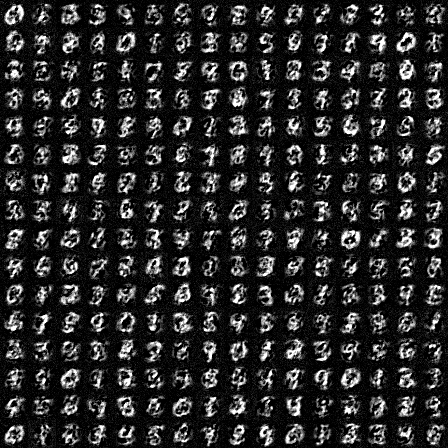
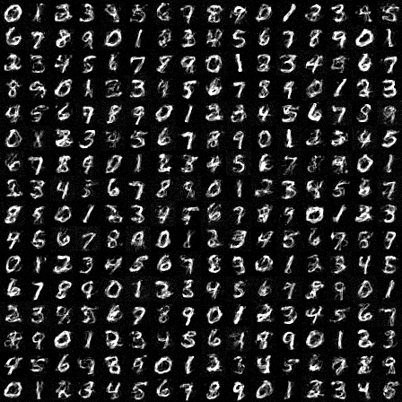
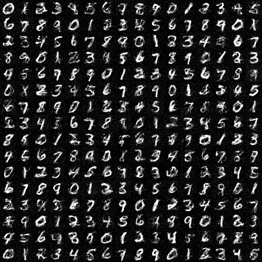
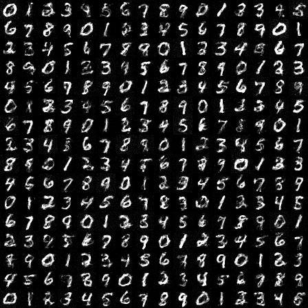
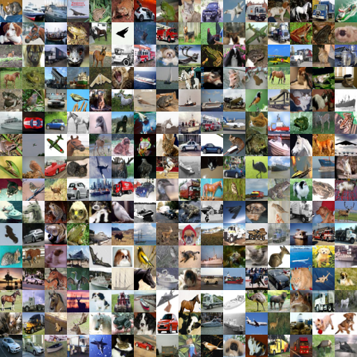
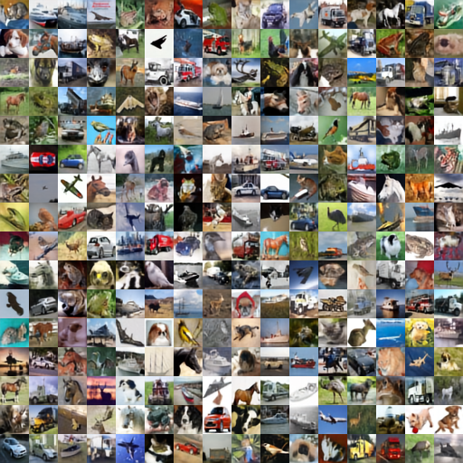
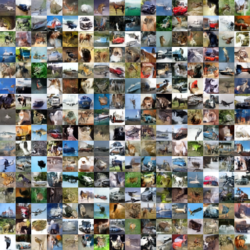
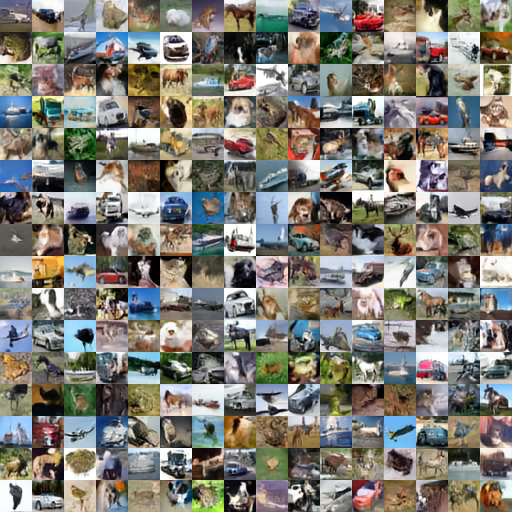

# MinDiff

A collection/playground for some minimal implementation of some diffusion models.

Try to use as less code as possible, with as simple arch as possible.

## Mnist

In this project we demo a minimal implementation of alpha-blended diffusion model which can train MNIST diffusion model with only 2 linear layer and an embedding layer for class cond.

Example result:

| lr5e-5                                         | lr2e-3                                         | lr5e-3                                         | 4loss lr2e-3*                                  |
| ---------------------------------------------- | ---------------------------------------------- | ---------------------------------------------- | ---------------------------------------------- |
|  |  |  |  |

*: It use mse loss on target, eps pred and x0 pred. Than we add ssim loss on x0 pred to obtain more clean result.

## Cifar

In this project we demo a minimal implementation of LDM + alpha blended diffusion model which can obtain an F4-C8 AE latent encoder/decoder with only 0.5M parameter. And a Conv+AdaLN Denoiser with only 10M params.

### AE image tokenizer/latent encoder

The arch is simple:

* Encoder: [Conv, Conv, Down]*n + [Conv, Conv]
* Decoder: [Conv, Conv, Up]*n + [Conv, Conv]

Image examples:

|                       | Cifar Input                                    | Cifar Recon                                    | Input*                           | Recon*                           |
| --------------------- | ---------------------------------------------- | ---------------------------------------------- | -------------------------------- | -------------------------------- |
| 0.5M param 1000 Epoch |  |  |  |  |

*: The model is trained on 32x32 and we tested it on 1024x1024 and we can see some significant artifact, we may finetune it on larger input such as 128x128 or 256x256 to fix this issue.

### Conv+AdaLN DM

For each ConvAdaNorm block we have: [GN, Conv, AdaLN Modulation, Mish, GN, Conv, residual]

The model directly use a sequence of ConvAdaNorm block instead of UNet-like arch.

Since the resolution of latent pixel is low (8x8 for Cifar10, or 16x16 when we train 64x64 images). We didn't introduce UNet-like arch which is too complicated.

Image Examples:

| 100epoch                                       | 500epoch                                       | 1000epoch                                      | 5000epoch                                      |
| ---------------------------------------------- | ---------------------------------------------- | ---------------------------------------------- | ---------------------------------------------- |
|  |  |  |  |
